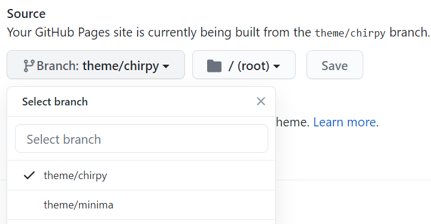

You might have noticed that the blog looks different. I've been thinking of updating the blog for quite some time but I never got around to it. I wanted a dark mode layout and toggle and the theme [Chirpy](https://github.com/cotes2020/jekyll-theme-chirpy) seemed to fit all my needs. The design is minimal and focuses on functionality. I like it.

Switching themes shouldn't be a hassle, and it mostly wasn't. While I was at it, I also decided to reorganise how the website repository was structured.

The plan was to enable myself to use the GitHub pages source setting to change the theme by changing the branch from which it was built.

{: width="500"}
_GitHub Pages Source Selection_

I started off with creating two branches: one for the old theme and one for the current one. I referred to [this answer on StackOverflow](https://stackoverflow.com/a/37186333/).

```bash
# create a branch for the current theme
git branch theme/minima origin/master

# set up a branch for the new theme
git checkout --orphan theme/chirpy
git rm -rf .
git clean -dfx
git remote add upstream https://github.com/cotes2020/jekyll-theme-chirpy.git
git fetch upstream
git pull upstream master

# copy over files from the master branch
git checkout master -- README.md about.md art.html projects.html projects assets
mv about.md art.html projects.html _tabs
```

While I was updating the jekyll configuration files and making minor design changes, I realised something. If I ever wanted to change the theme again in the future, I would have to go through this entire process once again.

To prevent unnecessary effort, I created a new repository called _blog-posts_ and added it as a submodule called *_posts* to the two branches.

```bash
git submodule add https://github.com/ricekot/blog-posts _posts
```

Then, I set up two GitHub actions to automatically trigger a site build by pulling in changes from the submodule when it was updated. 

For the *blog-posts* repository,
```yaml
name: Post Dispatch

on:
  push:
    branches: [ main ]
  workflow_dispatch:

jobs:
  build:
    runs-on: ubuntu-latest
    steps:
      - uses: actions/checkout@v2
      - name: Repository Dispatch
        uses: peter-evans/repository-dispatch@v1.1.3
        with:
          token: $\{\{ secrets.REPO_ACCESS_TOKEN \}\}
          repository: ricekot/ricekot.github.io
          event-type: new-post
```

You can notice that this workflow uses the [peter-evans/repository-dispatch](https://github.com/peter-evans/repository-dispatch) GitHub Action. As the name suggests, pushing to *blog-posts* creates a [repository dispatch webhook event](https://docs.github.com/en/free-pro-team@latest/actions/reference/events-that-trigger-workflows#repository_dispatch) with a *new-post* event type. 

When the main repository receives this event, it updates the submodule to the latest commit and triggers a site build by pushing the changes.

```yaml
name: Update Posts
on:
  repository_dispatch:
    types: [new-post]
  workflow_dispatch:
jobs:
  build:
    runs-on: ubuntu-latest
    steps:
      - uses: actions/checkout@v2
      - name: Update _posts submodule
        run: |
          git config --global user.name "github-actions[bot]"
          git config --global user.email "41898282+github-actions[bot]@users.noreply.github.com"
          git submodule update --init --remote --rebase
          git add -A
          git commit -m "Add new post"
          git push
```

There was one thing I missed, however: the *assets* folder. The images used in the blog posts were all in `/assets/images/`, which was not a part of *blog-posts*. This means that any time I wanted to include an image in a post I was writing, I would have to 
  1. Push the new post to *blog-posts*
  2. Push the assets to the main repo

I just wound up increasing my work - this process renders the purpose of creating a *blog-posts* submodule meaningless. Wasted effort? Not really. I thought of using the following structure for future posts...

```
_posts
  2020-11-30-new-theme
    index.md
  2020-12-12-minimalism
    index.md
    images
      coffee-cup.png
```

...only to find out later that Jekyll did not support this out of the box and GitHub Pages did not support it at all. "Well," I thought, "since I've come this far, I might as well go the full length."
And so, I added the [jekyll-postfiles](https://nhoizey.github.io/jekyll-postfiles/) gem to my Gemfile and created a Netlify account.

[](https://app.netlify.com/sites/ricekot/deploys)

So, did it work? Well, if you can see the images in this post, it sure did! Was it worth the effort? Not so sure about that. I'll stick with this for now and time will tell.
